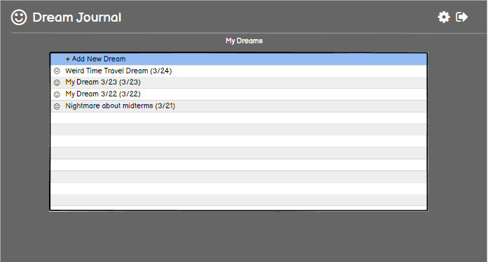
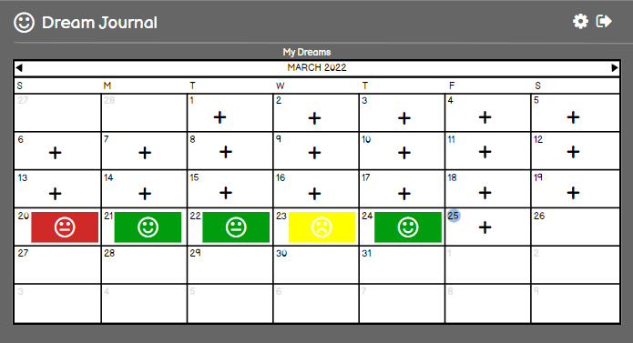
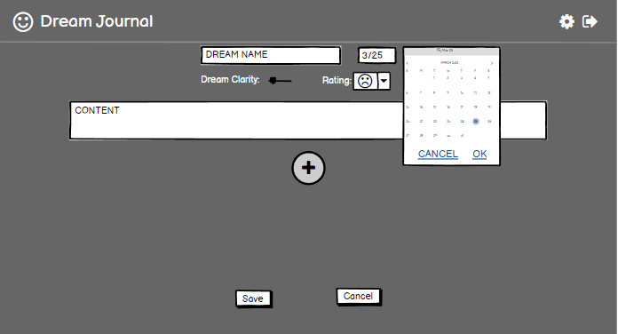
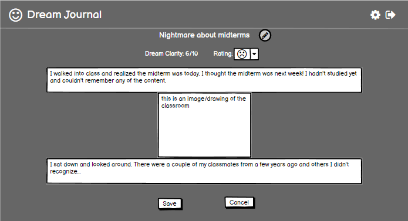
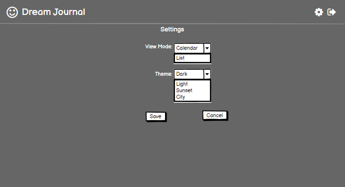
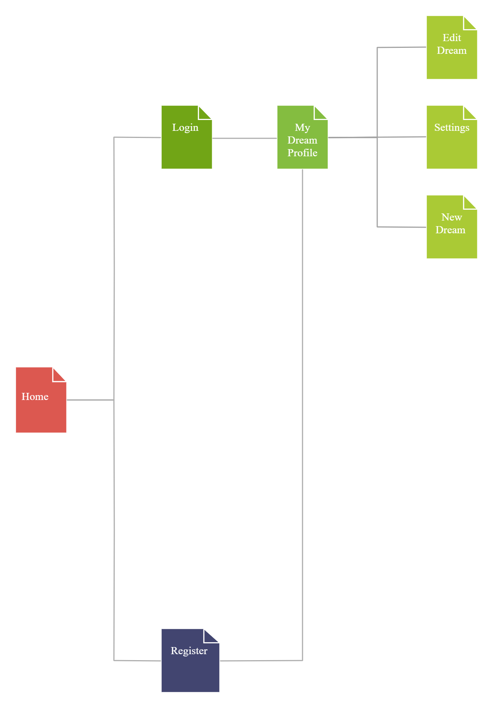

The content below is an example project proposal / requirements document. Replace the text below the lines marked "__TODO__" with details specific to your project. Remove the "TODO" lines.

# Dream Journal

## Overview

Have you ever had a dream that was really interesting but forgot about it an hour later? Dream Journal is a web application that let's you track your dreams. Users must login to store their dreams so they remain between sessions. Dreams are linked with a date and include a scale for users to rate how they felt afterwards. Users can name the dream. Additionally, users can view a calendar view of all of their dreams and how they felt about them. Included will be a settings menu for users to choose if they want a list or calendar view as their main page, and a theme customization. (If time permitting, users can share their dreams for others to see on a public forum. Other users can upvote or downvote a dream.)


## Data Model

The application will store Users, Dreams, and Sections

* users can have multiple dreams (via references - this is to set up the structure for sharing)
* dreams can have multiple sections (embedded)

An Example User:

```javascript
{
  username: // selected username,
  pass: // a password hash,
  theme: // integer representing user preferred theme
  calendar: // boolean T/F for user preferred view
  dreams: // an array of references to List documents
}
```

An Example Dream:

```javascript
{
  user: // a reference to a User object
  name: // name of dream
  date: // recorded date of dream
  quality: // user recorded quality of dream
  mood: // user mood - stored as integer - how they felt in the morning
  sections: [
    { item: "text", checked: false},
    { item: "image", data: "/images/image.png"},
  ],
  lastEdit: // timestamp for last edit
}
```


## [Link to Commented First Draft Schema](db.js)

(__TODO__: update schema draft in db.js_)

## Wireframes

/profile - page for showing all personal dreams - list and calendar view




/profile/create - page for creating a new dream



/profile/slug - page for viewing and editing specific dream



/settings - page for modifying user settings



## Site map


*Target Sitemap*


*Sharing Sitemap - To be implemented if time permitting*

## User Stories or Use Cases

1. as non-registered user, I can register a new account with the site
2. as a user, I can log in to the site
3. as a user, I can create a new dream entry
4. as a user, I can view all of my dream entries
5. as a user, I can edit existing dream entries
6. as a user, I can view my settings
7. as a user, I can change my visual settings in the settings
8. as a user, I can view a specific dream entry

## Research Topics

(__TODO__: update research topics during development_)

* (3 points) Configuration management - Node convict to manage deploys on local machine and free website hosting service such as Herokuapp.
* (3 points) Webpack to automate:
  * (2 points) Sass as a CSS preprocessor to help with managing themes.
* (1 point) External Client Side Library: [Calendarize](https://www.npmjs.com/package/calendarize) for generating the calendar view. It's relatively lightweight and I will need to make changes on top of it so I am assigning it one point.
* (1 point) External Client Side Library: [rich-markdown-editor](https://www.npmjs.com/package/rich-markdown-editor) for a nice text editor for users to use while editing and writing their dream entries.
* (1 point) External Client Side Library [canvas-sketch](https://www.npmjs.com/package/canvas-sketch) for users to draw images of their dreams if time permitting. Most of the package is fleshed out so I am assigning it one point.


10 points total out of 8 required points (11 if time permitting)


## [Link to Initial Main Project File](app.js)

## Annotations / References Used

1. [Setting up Sass and Webpack](https://dev.to/deepanjangh/setting-up-css-and-sass-with-webpack-3cg)
2. [For setting up Webpack with Express](https://binyamin.medium.com/creating-a-node-express-webpack-app-with-dev-and-prod-builds-a4962ce51334)
